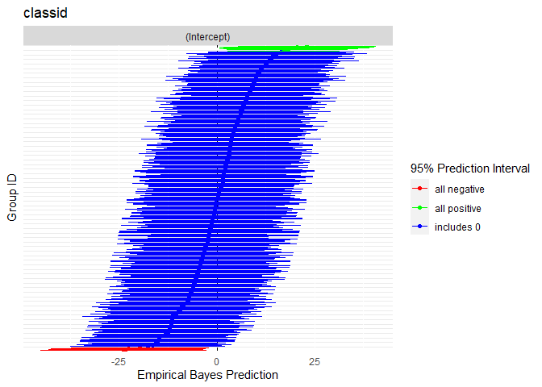

# mlmtools

Multilevel and mixed effects models often require specialized data
pre-processing and further post-estimation derivations and graphics to
gain insight into model results. `mlmtools` is a suite of pre- and
post-estimation tools for multilevel models in R. The package’s
post-estimation tools are designed to work with models estimated using
`lme4`’s lmer function, which fits linear mixed effects regression
models. Although nearly all the functions provided in the `mlmtools`
package exist as singleton functions within other R packages, they are
often improved in `mlmtools` and more accessible by being located within
a multilevel modeling specific package.

The package was developed by Jessica Mazen, Laura Jamison, Erik Ruzek,
and Gus Sjobek.

## Included functions

-   Center level-1 predictors around their group (cluster) means
-   Intraclass correlation coefficients (ICC)
-   Variance explained
    -   When comparing nested models
    -   
-   Test of necessity of random intercepts
-   Visualizations
    -   Associations between variables within clusters
    -   Associations between variables between clusters
    -   Caterpillar plots

## Installation

To install the latest release version (0.0.0.9) from
[GitHub](https://github.com/) with:

``` r
# install.packages("devtools")
devtools::install_github("lj5yn/mlmtools")
```

## Sample workflow

Working with the included data, we briefly show how some of the included
functions can be used.

``` r
# data
library(mlmtools)
library(lme4)
#> Loading required package: Matrix
data("instruction")

# fit variance components model
fit1 <- lmer(mathgain ~ 1 + (1|classid), instruction)
  
# intraclass correlation coefficient
ICCm(fit1)
#> Likeness of mathgain values of units in the same classid factor: 0.149

# add predictor
fit2 <- lmer(mathgain ~ mathkind + (1|classid), instruction)

# variance explained by adding predictor
varCompare(fit2, fit1)
#> fit2 explains 30.91% more variance than fit1
```

## Visualizations

Rich visualizations of associations can be had along with caterpillar
plots, which graph the 95% prediction intervals for the random effects.

``` r
# visualze within-group association
withinPlot(x = "mathkind", y = "mathgain", grouping = "classid", dataset = instruction)
```


``` r
# caterpillar plot
caterpillarPlot(fit2, grpvar = "classid")
#> [1] "classid"
```


