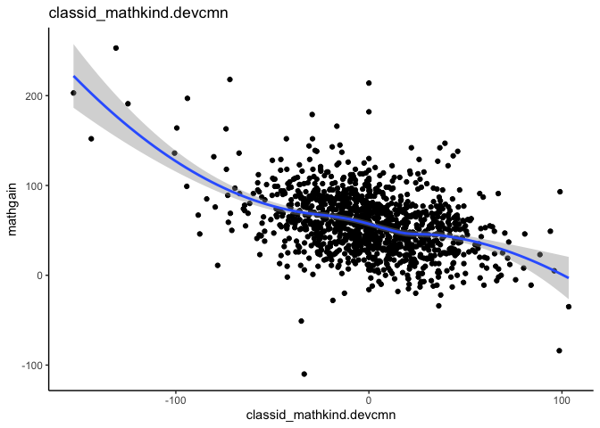
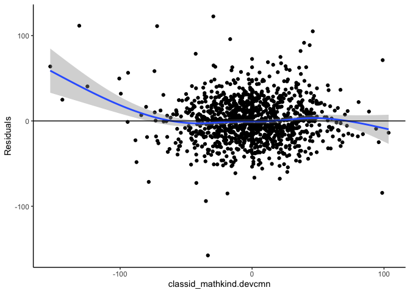
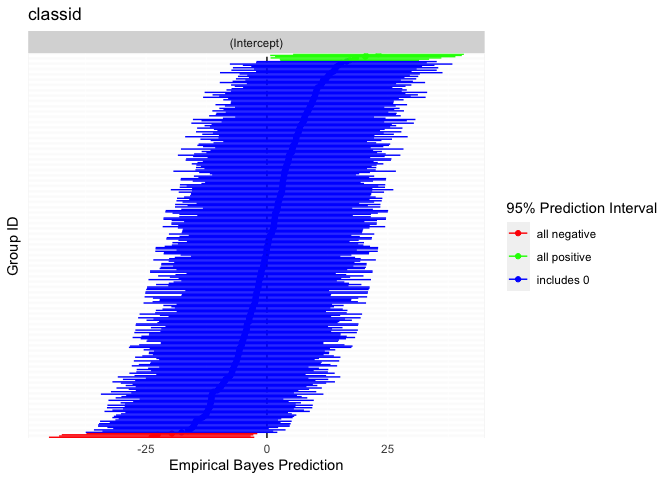

# mlmtools

Multilevel and mixed effects models often require specialized data
pre-processing and further post-estimation derivations and graphics to
gain insight into model results. `mlmtools` is a suite of pre- and
post-estimation tools for multilevel models in R. The package’s
post-estimation tools are designed to work with models estimated using
`lme4`’s lmer function, which fits linear mixed effects regression
models. Although nearly all the functions provided in the `mlmtools`
package exist as singleton functions within other R packages, they are
often improved in `mlmtools` and more accessible by being located within
a multilevel modeling specific package.

The package was developed by Laura Jamison, Jessican Mazen, Erik Ruzek,
and Gus Sjobek.

## Included functions

-   Center level-1 predictors around their group (cluster) means
-   Intraclass correlation coefficients (ICC)
-   Variance explained
    -   When comparing nested models
    -   
-   Visualizations
    -   Associations between variables within clusters
    -   Associations between variables between clusters
    -   Caterpillar plots
-   Test model assumptions

## Installation

To install the latest release version (1.0.0) from
[GitHub](https://github.com/) with:

``` r
# install.packages("devtools")
devtools::install_github("lj5yn/mlmtools")
```

## Sample workflow

Working with the included data, we briefly show how some of the included
functions can be used.

``` r
# data
library(mlmtools)
library(lme4)
#> Loading required package: Matrix
data("instruction")

# fit variance components model
fit1 <- lmer(mathgain ~ 1 + (1|classid), instruction)
  
# intraclass correlation coefficient
ICCm(fit1)
#> Likeness of mathgain values of units in the same classid factor: 0.149

# group-mean center mathkind 
center(instruction, x="mathkind", grouping = "classid")
#> The following variables (deviation, group summary) were added to the dataset: 
#>  classid_mathkind.devcmn classid_mathkind.cmn 
#> See mlmtools documentation for detailed description of variables added.

# add group-mean centered and group mean as predictors
fit2 <- lmer(mathgain ~ classid_mathkind.devcmn + classid_mathkind.cmn + (1|classid), instruction)

# variance explained by adding predictor
varCompare(fit2, fit1)
#> fit2 explains 31.08% more variance than fit1

# test model assumptions
mlm_assumptions(fit2)
#> Homogeneity of variance assumption met.
#> 
#> Model contains fewer than 2 terms, multicollinearity cannot be assessed.
#> 
#> No outliers detected.
#> 
#> Visually inspect all 4 plot types by calling them from the object created by mlm_assumptions() such as object$fitted.residual.plot and object$resid.normality.plot. linearity.plots and resid.component.plots may contain more than one plot depending on the model specified. Check how many there are, for example using length(object$linearity.plots). Then inspect each plot within each object, for example using object$linearity.plots[[1]] to access the first plot within the linearity.plots list.
#> 
#> See ?mlm_assumptions for more details and resources.
#> 
#> $linearity.plots
#> $linearity.plots[[1]]
```



    #> 
    #> $linearity.plots[[2]]


    #> 
    #> 
    #> $homo.test
    #> Analysis of Variance Table
    #> 
    #> Response: model.Res2
    #>             Df     Sum Sq Mean Sq F value  Pr(>F)  
    #> classid      1    6872688 6872688  3.4323 0.06418 .
    #> Residuals 1188 2378796930 2002354                  
    #> ---
    #> Signif. codes:  0 '***' 0.001 '**' 0.01 '*' 0.05 '.' 0.1 ' ' 1
    #> 
    #> $fitted.residual.plot


    #> 
    #> $outliers
    #> [1] "664"
    #> 
    #> $resid.normality.plot


    #> 
    #> $resid.component.plots
    #> $resid.component.plots[[1]]
    #> `geom_smooth()` using method = 'gam' and formula 'y ~ s(x, bs = "cs")'



    #> 
    #> $resid.component.plots[[2]]
    #> `geom_smooth()` using method = 'gam' and formula 'y ~ s(x, bs = "cs")'


    #> 
    #> 
    #> $multicollinearity
    #> [1] "Model contains fewer than 2 terms, multicollinearity cannot be assessed.\n"
    #> 
    #> attr(,"class")
    #> [1] "mlm_assumptions"

    # variance explained by the model
    rsqmlm(fit2)
    #> 24.58% of the total variance is explained by the fixed effects.
    #> 37.73% of the total variance is explained by both fixed and random effects.

## Visualizations

Rich visualizations of associations can be had along with caterpillar
plots, which graph the 95% prediction intervals for the random effects.

``` r
# visualize between-group association
betweenPlot(x = "mathkind", y = "mathgain", grouping = "classid", dataset = instruction, xlab = "Kindergarten Math Score", ylab = "Gain in Math Score")
```


``` r

# visualze within-group association
withinPlot(x = "mathkind", y = "mathgain", grouping = "classid", dataset = instruction)
```


``` r

# caterpillar plot
caterpillarPlot(fit2, grouping = "classid")
#> [1] "classid"
```


