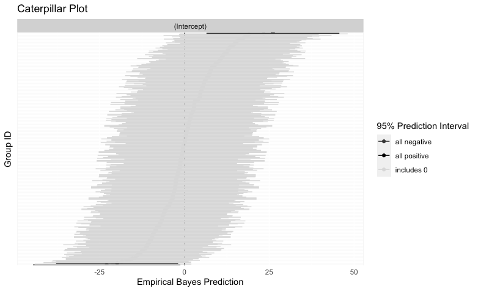
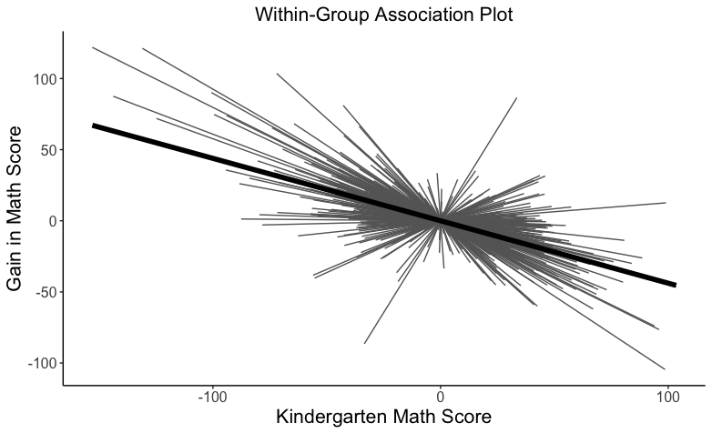

# Summary

Multilevel data in which individual observations are contained within larger organizational units are ubiquitous in the natural and social sciences, in longitudinal data, and in applied fields such as education, business, and government. Multilevel data presents unique challenges for data analysts. Although organizational units may be distinct from one another, individual observations within an organizational unit are more similar than individual observations from other groups. In statistical terms, the similarity of observations within a unit leads to non-trivial correlations among those observations. The analysis of multilevel data requires statistical models that can appropriately account for the correlated nature of such data. 

Multilevel models are the statistical tool of choice for analyzing multilevel data [@Searle_1992]. These models account for the correlated nature of observations within higher level units by adding group-level error terms that augment the singular residual error of a standard OLS regression. They are also referred to as mixed effects models because these models treat some statistical parameters as fixed whereas others are treated as random. Fixed parameters are those that do not vary across higher-level groups whereas random parameters vary across groups such that each group has its own unique value for that parameter, whether it be an intercept or slope [@Gelman_Gelman_Hill_2006]. Instead of estimating the unique value or deviations associated with each group, multilevel models treat these values as being drawn from a population of similar groups, each associated with a population mean and variance. Accordingly, mixed effects models have connections to Bayesian regression modeling [@Gelman_Gelman_Hill_2006]. The multilevel modeling framework accommodates both continuous outcomes and binary, ordinal, count, and other non-continuous outcomes via generalized linear mixed effects models [@skrondal2004generalized]. Multiple reference books have been written on multilevel models, including @goldstein2011multilevel, @Rabe_Hesketh_Skrondal_2012, @raudenbush2002hierarchical, and @snijders2011multilevel. Longitudinal or repeated measures data can be analyzed within the multilevel modeling framework; several books address longitudinal modeling, including @fitzmaurice2012applied, @hedeker2006longitudinal, and @hoffman2015longitudinal.

# Statement of need

Software implementations of multilevel models are found in nearly all general-purpose software programs, including R (`nlme`). User-written packages for estimating multilevel models abound in R, including but not limited to, `GLMMadaptive` [@Rizopoulos_2021], `glmmTMB` [@brooks2017glmmtmb], `mixor` [@Kellie_mixor], `PLmixed` [@rockwood2019estimating], `blme` [@chung2013nondegenerate], and `lme4` [@bates2014fitting].

The multitude of software packages for estimating mixed effects models is a boon to researchers, however multilevel and mixed effects models often require specialized data pre-processing and further post-estimation derivations and graphics to gain insight into model results. Unfortunately, few are packages exclusively dedicated to these tasks. The package presented here, `mlmtools`, is a suite of pre- and post-estimation tools for multilevel models in R. The package's post-estimation tools are designed to work with models estimated using `lme4`'s lmer function, which fits linear mixed effects regression models. Although nearly all the functions provided in the `mlmtools` package exist as singleton functions within other R packages, they are often improved in `mlmtools` and more accessible by being located within a multilevel modeling specific package.

# Demonstration

We briefly demonstrate the usage of the package by first using `lme4` [@bates2014fitting] to run a multilevel model on the instruction data provided in the package, which has a structure of children nested within classrooms. The null model we fit has no predictors and a single random intercept for classrooms. 

```{r}
# Load necessary packages
library(mlmtools)
library(lme4)
library(lmerTest)

# Fit a null model
data(instruction)
mod0 <- lmer(mathgain ~ (1 | classid), data = instruction)
```

## Intraclass correlation coefficient (ICC)
```{r}
ICCm(mod0)
#> Likeness of mathgain values of units in the same classid factor: 0.149
```
The ICC, or likeness of mathgain values at the class level is 0.15. Stated equivalently, the expected correlation between the maths gain scores of two randomly-chosen students in the same randomly-chosen classroom is 0.15.

## Caterpillar plot
```{r}
caterpillarPlot(mod0, title = "title", grpvar = "classid", grey = TRUE)
```


This plot shows the 95% prediction intervals for the random intercepts for classrooms in the data based on the null model. 

## Comparing nested models fit to the same data
```{r}
mod1 <- lmer(mathgain ~ mathkind + (1 | classid), data = instruction)
# Assess the gain in variance explained
varCompare(mod0, mod1)
#> mod1 explains 23.61% more variance than mod0
``` 
The model with one predictor, as compared to the model with no predictor, explains an additional 24% of variance in maths gains. 

## Test model assumptions
```{r}
mod1_assum <- mlm_assumptions(mod1)
```

The model meets the assumption of homogeneity of variance, no outliers were detected, and passes a visual inspection of all plots. Multicollinearity could not be assessed since only one predictor is present in the model.

## Centering predictors 
```{r}
center(dataset = instruction, x = "mathkind", grouping = "classid")
#> The following variables (group summary, deviation) were added to the dataset: 
#>  classid_mathkind.devcmn classid_mathkind.cmn 
#> See mlmtools documentation for detailed description of variables added.

# A model with centered mathkind
mod2 <- lmer(mathgain ~ classid_mathkind.cmn + classid_mathkind.devcmn +
               (1 | classid), data = instruction)
               
summary(mod2)
#> Linear mixed model fit by REML. t-tests use Satterthwaite's method [lmerModLmerTest]
#> Formula: mathgain ~ classid_mathkind.cmn + classid_mathkind.devcmn + (1 |  
#>     classid)
#>    Data: instruction
#> 
#> REML criterion at convergence: 11450.2
#> 
#> Scaled residuals: 
#>     Min      1Q  Median      3Q     Max 
#> -5.7220 -0.6040 -0.0290  0.5634  4.4473 
#> 
#> Random effects:
#>  Groups   Name        Variance Std.Dev.
#>  classid  (Intercept) 160.3    12.66   
#>  Residual             759.1    27.55   
#> Number of obs: 1190, groups:  classid, 312
#> 
#> Fixed effects:
#>                          Estimate Std. Error        df t value Pr(>|t|)    
#> (Intercept)             239.05138   17.94097 336.08243   13.32   <2e-16 ***
#> classid_mathkind.cmn     -0.38982    0.03842 333.78404  -10.15   <2e-16 ***
#> classid_mathkind.devcmn  -0.43875    0.02593 884.47936  -16.92   <2e-16 ***
#> ---
#> Signif. codes:  0 ‘***’ 0.001 ‘**’ 0.01 ‘*’ 0.05 ‘.’ 0.1 ‘ ’ 1
#> 
#> Correlation of Fixed Effects:
#>                (Intr) clssd_mthknd.c
#> clssd_mthknd.c -0.998               
#> clssd_mthknd.d  0.000  0.000
```

Centering level-1 predictors is beneficial for understanding outcome associations within and between units. The within-classroom association between maths scores in kindergarten (calssid_mathkind.devcmn) and maths score gains is -0.44(.03); between classrooms, higher mean maths kindergarten scores (classid_mathkind.cmn) are also negatively associated with average maths gains.  

## R-Squared
```{r}
rsqmlm(mod2)
#> 24.58% of the total variance is explained by the fixed effects.
#> 37.73% of the total variance is explained by both fixed and random effects.
```
## Plotting within and between associations
```{r}
mathkind_withinPlot <- withinPlot(x = "mathkind", y = "mathgain",
                                  grouping = "classid", dataset = instruction,
                                  xlab = "Kindergarten Math Score",
                                  ylab = "Gain in Math Score")
```


The unadjusted within-classroom associations between maths scores in kindergarten and math gains are visualized above and the between classroom association below. 


```{r}
mathkind_betweeenPlot <- betweenPlot(x = "mathkind", y = "mathgain",
                                     grouping = "classid", dataset = instruction,
                                     xlab = "Kindergarten Math Score",
                                     ylab = "Gain in Math Score")
```


```{r}
caterpillarPlot(mod2, grouping = "classid")
```


# Acknowledgements

The authors are grateful to Christof Fehrman, Jacob Goldstein-Greenwood, Joseph Kush, and Donald Williams for helpful feedback on the functions and code.

# References


